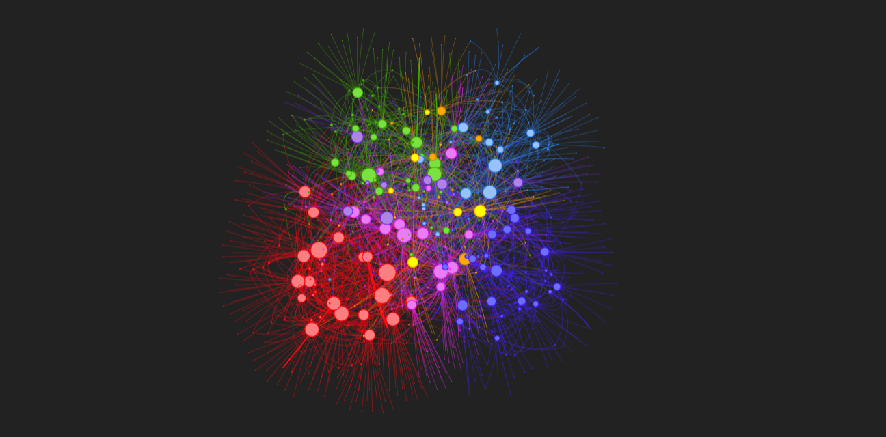
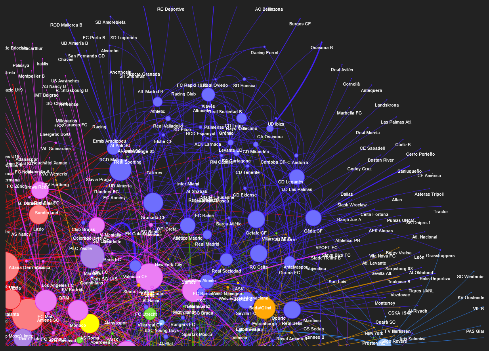

# Football Transfer Analysis - Season 23/24




This project creates a network visualization of all the transfers in the top 5 European football leagues. The visualization illustrates the transfer movements between clubs, providing insights into the transfer dynamics and central clubs in the network.

## Table of Contents
- [Overview](#overview)
- [Data Collection](#data-collection)
- [Data Cleaning](#data-cleaning)
- [Visualization](#visualization)
- [Installation](#installation)
- [Usage](#usage)
- [Contributing](#contributing)
- [License](#license)

## Overview

Every football season, clubs build up new teams, and fans watch the transfer market with new hopes for the upcoming season. Transfers play a crucial role in shaping teams' fortunes, making the transfer market a focal point of excitement and speculation. 

This project visualizes the network of football transfers among clubs in the top 5 European leagues: the Premier League, La Liga, Serie A, Bundesliga, and Ligue 1. 

The project aims to:
1. Data Collection: Gather transfer data from relevant sources.
2. Data Cleaning: Process and clean the collected data.
3. Visualization: Create an interactive network visualization to display the transfers.

## Data Collection

The data is collected from transfermarkt.es, which provides detailed information about football transfers, including player names, transfer fees, and the clubs involved.

## Data Cleaning

After collecting the data, it is cleaned to ensure accuracy and consistency. This includes removing duplicates, correcting errors, and formatting the data appropriately for analysis.

## Visualization

The cleaned data is used to create a network graph where nodes represent football clubs and edges represent transfers between them. The visualization is interactive and highlights key metrics such as:
- Degree centrality
- Closeness centrality
- Betweenness centrality
- Community detection using the Louvain method

### Example Visualization



## Installation

To run this project locally, follow these steps:

1. Clone the repository:
   ```bash
   git clone https://github.com/PerezCorrea/football_transfer_analysis.git
   ```

2. Navigate to the project directory:
   ```bash
   cd football_transfer_analysis
   ```

3. Install the required dependencies:
   ```bash
   pip install -r requirements.txt
   ```

## Usage

To make your own visualization and just follow the steps in this jupyter notebook: [transfer_network.ipynb](transfer_network.ipynb)

The resulting visualization will be saved as `transfer.html` and can be opened in any web browser.

## Contributing

Contributions are welcome! If you have any suggestions or improvements, please create an issue or submit a pull request.

1. Fork the repository.
2. Create a new branch:
   ```bash
   git checkout -b feature-branch
   ```
3. Make your changes and commit them:
   ```bash
   git commit -m "Add some feature"
   ```
4. Push to the branch:
   ```bash
   git push origin feature-branch
   ```
5. Open a pull request.

## License

This project is licensed under the MIT License - see the [LICENSE](LICENSE) file for details.

---

Feel free to customize this draft according to your preferences and the specific details of your project.